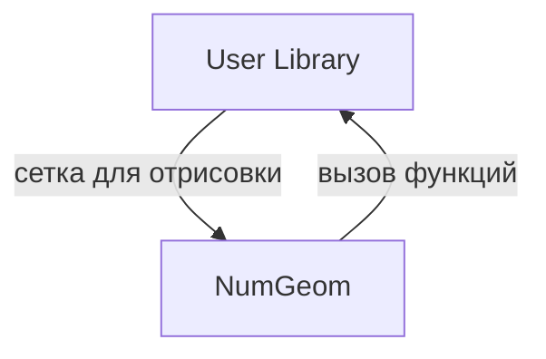

# NumGeom Framework

**Фреймворк для прототипирования инженерных интерактивных трехмерных графических приложений**

* **трехмерный** -- отрисовывает на экране трехмерную сцену;
* **интерактивный** -- приложение реагирует на действия пользователя, не дожидаясь подтверждения;
* **графический** -- поддерживает графический интерфейс пользователя;
* **инженерный** -- ориентирован на решение инженерных задач;

Проект предоставляет готовую инфраструктуру для быстрого создания интерфейса к существующим инженерным приложениям:
* расширениям к геометрическим ядрам (OpenCASCADE, C3D);
* вычислительным кодам с консольным интерфейсом;
* пользовательским программным библиотекам с трехмерными структурами данных и функциями их обработки.

## Ключевые возможности

Пользователь предоставляет в виде библиотек собственные структуры данных трехмерных объектов и функции для работы с ними.

Использование фреймворка дает:
* заготовку приложения под Windows, Linux;
* рендеринг трехмерных объектов;
* быстрое подключение пользовательских функций в приложение;
* выборка и перетаскивание объектов сцены мышью;
* сценарии автоматической сборки, тестирования и упаковки проекта;
* доступ к функциям приложения через интерпретатор Python.

## Состав технологий

Состав используемых технологий минимален и может быть сконфигурирован по требованию.

Обязательные компоненты:
* Vulkan для рендеринга;
* Vcpkg и CMake для сборки проекта;

Опциональные компоненты:
* Qt для пользовательского интерфейса;
* OpenCascade для моделирования и анализа;
